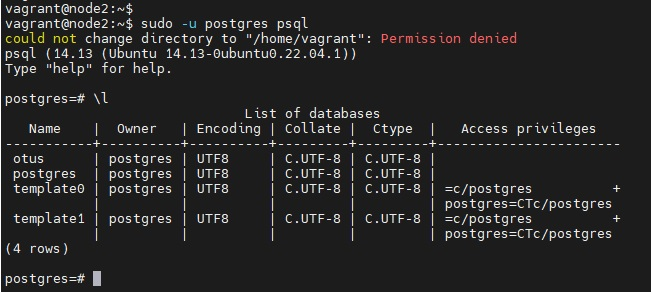

# Otus Homework 27. PostreSQL.
### Цель домашнего задания
Научиться настраивать репликацию и создавать резервные копии в СУБД PostgreSQL.
### Описание домашнего задания
1) Настроить hot_standby репликацию с использованием слотов
2) Настроить правильное резервное копирование

## Выполнение

С помощью _vagrant_ развернем тестовый стенд:
|Имя|IP-адрес|ОС|
|-|-|-|
|node1|192.168.56.11|Ubuntu 22.04|
|node2|192.168.56.12|Ubuntu 22.04|
|barman|192.168.56.13|Ubuntu 22.04|
### Настройка репликации
Настроим хочты **node** и **node2**. Установим _postgresql_:
```bash
apt install postgresql postgresql-contrib
systemctl enable --now postgresql
```
На хосте **node1** создадим пользователя для репликации:
```bash
 sudo -u postgres psql

CREATE USER replicator WITH REPLICATION Encrypted PASSWORD 'Qwerty123';
```
На обоих хостах изменим конфигураыионные файлы:
#### /etc/postgresql/14/main/postgresql.conf
```
data_directory = '/var/lib/postgresql/14/main'          # use data in another directory
hba_file = '/etc/postgresql/14/main/pg_hba.conf'        # host-based authentication file
ident_file = '/etc/postgresql/14/main/pg_ident.conf'    # ident configuration file
external_pid_file = '/var/run/postgresql/14-main.pid'   # write an extra PID file
#Указываем ip-адреса, на которых postgres будет слушать трафик на порту 5432 (параметр port)
listen_addresses = 'localhost, 192.168.56.11'
#Указываем порт порт postgres
port = 5432
#Устанавливаем максимально 100 одновременных подключений
max_connections = 100
log_directory = 'log'
log_filename = 'postgresql-%a.log'
log_rotation_age = 1d
log_rotation_size = 0
log_truncate_on_rotation = on
max_wal_size = 1GB
min_wal_size = 80MB
log_line_prefix = '%m [%p] '
#Указываем часовой пояс для Москвы
log_timezone = 'UTC+3'
timezone = 'UTC+3'
datestyle = 'iso, mdy'
lc_messages = 'en_US.UTF-8'
lc_monetary = 'en_US.UTF-8'
lc_numeric = 'en_US.UTF-8'
lc_time = 'en_US.UTF-8'
default_text_search_config = 'pg_catalog.english'
#можно или нет подключаться к postgresql для выполнения запросов в процессе восстановления;
hot_standby = on
#Включаем репликацию
wal_level = replica
#Количество планируемых слейвов
max_wal_senders = 3
#Максимальное количество слотов репликации
max_replication_slots = 3
#будет ли сервер slave сообщать мастеру о запросах, которые он выполняет.
hot_standby_feedback = on
#Включаем использование зашифрованных паролей
password_encryption = scram-sha-256
include_dir = 'conf.d'
```
#### /etc/postgresql/14/main/pg_hba.conf
```bash
# TYPE  DATABASE        USER            ADDRESS                 METHOD
# "local" is for Unix domain socket connections only
local   all                  all                                                peer
# IPv4 local connections:
host    all                  all             127.0.0.1/32              scram-sha-256
# IPv6 local connections:
host    all                  all             ::1/128                       scram-sha-256
# Allow replication connections from localhost, by a user with the
# replication privilege.
local   replication     all                                                peer
host    replication     all             127.0.0.1/32               scram-sha-256
host    replication     all             ::1/128                        scram-sha-256
host    replication     replicator     192.168.56.11/32        scram-sha-256
host    replication     replicator     192.168.56.12/32        scram-sha-256
host    all             barman   192.168.56.13/32        scram-sha-256
host    replication     barman   192.168.56.13/32        scram-sha-256
```
Перезапустим службу _postgresql_:
```bash
systemctl restart postgresql
```
На хосте **node2** удалим содержимое папки _/var/lib/postgresql/14/main/_ и, используя утилиту _pg_basebackup_, скопируем данные с **node1**:
```bash
systemctl stop postgresql
rm -rf /var/lib/postgresql/14/main/*
pg_basebackup -h 192.168.56.11 -U  replicator -D  /var/lib/postgresql/14/main/ -R -P
systemctl start postgresql
```
Репликаций настроена. Для проверки создадим тестовую базу на **node1** и убедимся, что она успешно реплицировалась на **node2**:
```
postgres=# CREATE DATABASE otus;
CREATE DATABASE
```

  

Для выполнения задания с помощью _ansible_ запустим плэйбук:
```bash
ansible-playbook psql_repl.yml
```
### Настройка резервного копирования
Резервное копирование будет осуществляться с помощтю утилиты _Barman_. Установим необходимые пакеты:
```bash
apt install barman-cli barman postgresql
```
На обоих серверах необходимо командой `ssh-keygen -t rsa -b 4096` сгенерировать ssh-ключи для пользователей _postgres_ и _barman_ соответственно, и скопировать содержимое публичных ключей в authorized_hosts соответсвующих серверов.
На **node1** необходимо создать пользователя postgresql с необходимыми правами и перезапустить службу:
```
CREATE USER barman WITH REPLICATION Encrypted PASSWORD 'Qwerty123';
```
А также внести изменения в _pg_hba.conf_:
```bash
...
host    all                 barman       192.168.56.13/32      scram-sha-256
host    replication         barman       192.168.56.13/32      scram-sha-256
```
